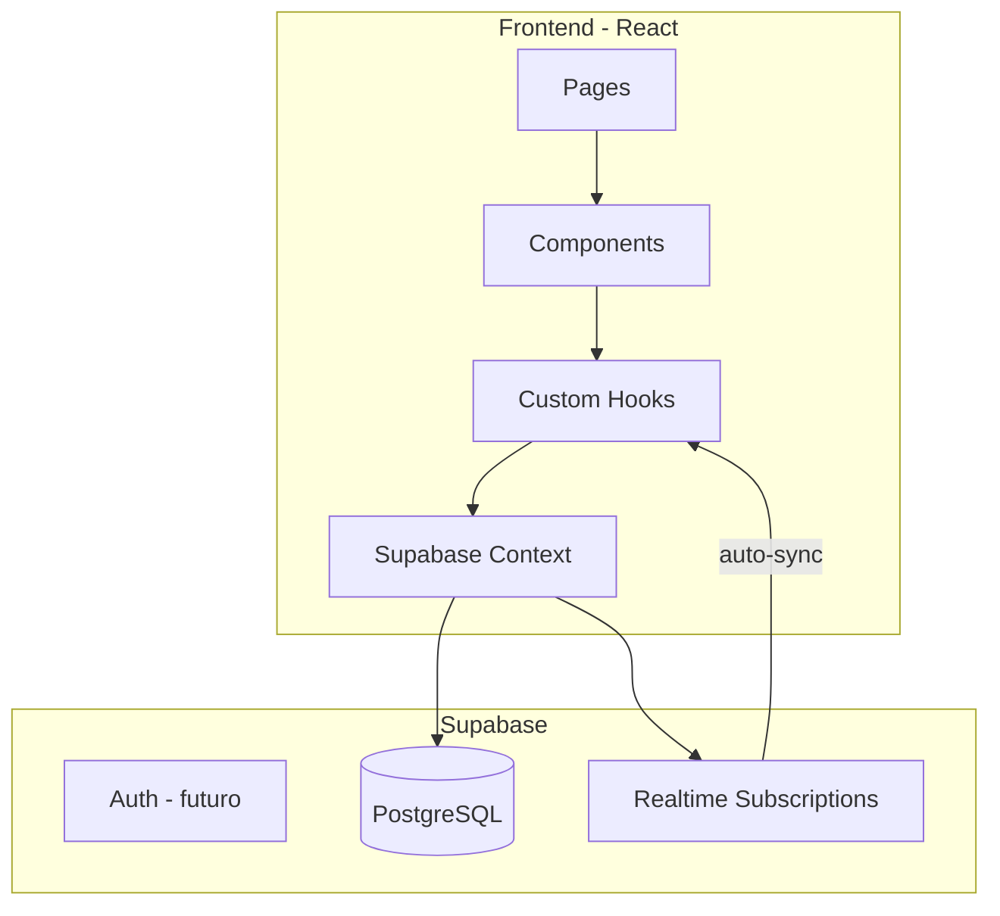
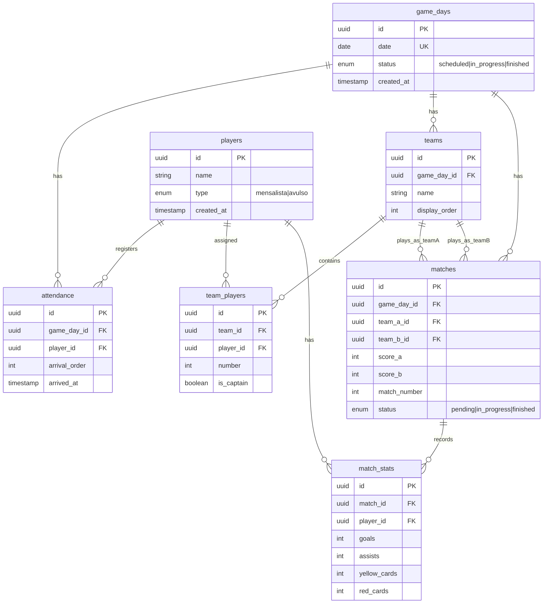
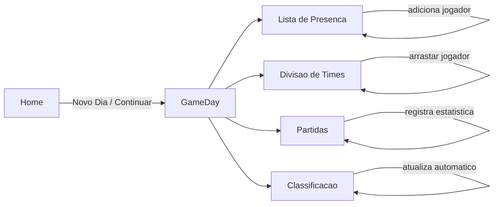

# Plano de Desenvolvimento - Deu Jogo

**Stack:** React (Vite) + CSS Modules + Supabase

---

## Arquitetura Geral



---

## Modelagem do Banco de Dados (Supabase)



---

## Estrutura de Pastas

```
deu-jogo/
├── src/
│   ├── components/
│   │   ├── AttendanceList/
│   │   ├── TeamBuilder/
│   │   ├── MatchCard/
│   │   ├── Scoreboard/
│   │   ├── StandingsTable/
│   │   └── common/
│   ├── pages/
│   │   ├── Home/
│   │   └── GameDay/
│   ├── hooks/
│   │   ├── useGameDay.js
│   │   ├── useAttendance.js
│   │   ├── useTeams.js
│   │   └── useMatches.js
│   ├── services/
│   │   └── supabase.js
│   ├── context/
│   │   └── GameDayContext.js
│   └── styles/
│       └── global.css
├── .env
└── package.json
```

---

## Fluxo Principal da Aplicação



---

## Etapas de Implementação

### 1. Setup Inicial

- Criar projeto React com Vite
- Configurar Supabase (projeto + client)
- Criar estrutura de pastas e CSS global com tema escuro/esportivo

### 2. Banco de Dados

- Criar tabelas no Supabase conforme modelagem
- Configurar Row Level Security (RLS) básico
- Habilitar Realtime nas tabelas principais

### 3. Página Home

- Botão "Iniciar Dia de Jogo" (cria com data atual, mas que pode ser modificada para criar jogo no passado ou futuro)
- Status do dia: `scheduled` (agendado), `in_progress` (em andamento), `finished` (encerrado)
- Lista de dias anteriores para continuar/visualizar. Podendo continuar apenas se status != `finished`

### 4. Lista de Presença

- De forma rápida, buscar jogador cadastrado ou cadastrar com nome + tipo.
- Ordenação automática: mensalistas primeiro, em ordem de chegar e depois por ordem de chegada dos avulsos
- Indicador visual do tipo de jogador.

### 5. Divisão de Times

- 4 times padrão (Time A, B, C, D)
- Adicionar/remover times
- Editar nome do time
- Arrastar jogadores da lista de presença para times
- Definir opcionalmente número e capitão
- **Histórico preservado:** Times são criados por dia (`game_day_id`), então o vínculo jogador-time persiste automaticamente no histórico mesmo após encerrar o dia

### 6. Gestão de Partidas

- Criar partida selecionando 2 times
- Atualizar placar em tempo real (botões +/-)
- Registrar estatísticas por jogador (gols, assistências, cartões)

- Tudo na mesma tela e em tempo real
- Status da partida (pendente, em andamento, finalizada)

### 7. Classificação

- Tabela com pontos, vitórias, empates, derrotas, saldo de gols, número de cartões
- Atualização automática via Realtime do Supabase

### 8. Auto-save

- Todas as operações salvam automaticamente no Supabase
- Feedback visual discreto de salvamento

---

## Identidade Visual - Champions League

- **Cores Principais:**
  - Azul Escuro (primária): `#1C2C5B`
  - Azul Noite (fundo): `#0A1128`
  - Branco (textos): `#FFFFFF`
  - Dourado (destaques/estrelas): `#D4AF37`
  - Cinza (secundário): `#6C757D`
- **Tipografia:** Bold para números/placares, clean para textos
- **Layout:** Cards para partidas, tabelas compactas, botões grandes para toque
- **Efeitos:** Gradientes sutis no fundo, bordas douradas em elementos de destaque